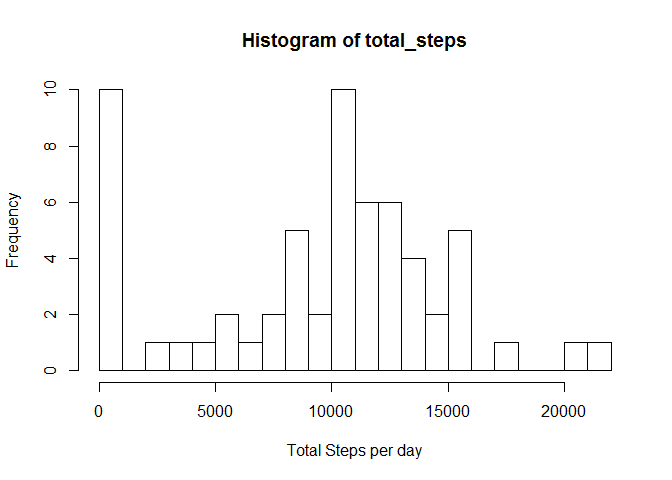
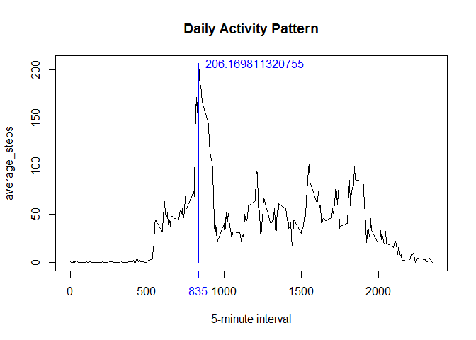
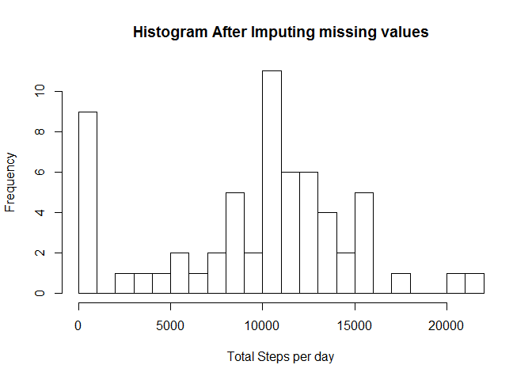
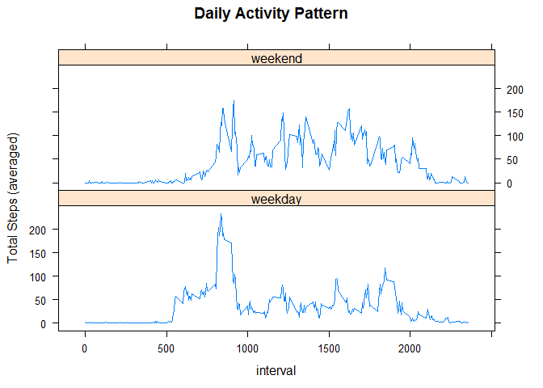

### PA1_template

The unzipped Activity Monitoring data file is **activity.csv**  and contains 3 variables: steps, date and interval.

The R script for this analysis uses additional installed packages: "plyr" and "lattice".

```r
library(lattice)
library(plyr, quietly=TRUE)
```

```
## Warning: package 'plyr' was built under R version 3.1.1
```

**Loading data from the activity monitoring file and reformating date variable:**


```r
activity<-read.csv("activity.csv")
activity$date<- as.character(levels(activity$date))[activity$date]
activity$date<- as.Date(activity$date, "%Y-%m-%d")
```

**Creating Histogram of Total Steps taken each day:**

```r
daily_total<- ddply(activity, .(date), summarize, 
                    total_steps = sum(steps, na.rm=TRUE))
with(daily_total, hist(total_steps, breaks=18, xlab="Total Steps per day"))
```

 

**Mean and Median:**

```r
total_steps_stat<-summary(daily_total$total_steps)
Mean_original<- total_steps_stat["Mean"]
Median_original<- total_steps_stat["Median"]
print(Mean_original)
```

```
## Mean 
## 9350
```

```r
print(Median_original)
```

```
## Median 
##  10400
```

**Plotting average daily activity pattern:**

```r
interval_averages<- ddply(activity, .(interval), summarize,
                        average_steps=mean(steps, na.rm=TRUE))
ymax<- max(interval_averages$average_steps)
xmax<- interval_averages[interval_averages$average_steps==ymax, "interval"]

with(interval_averages, plot(interval, average_steps, type ="l",
                             xlab="5-minute interval",
                             main="Daily Activity Pattern"))
axis(1,xmax, col.ticks="blue", col.axis="blue")
lines(xmax,ymax, type="h", col="blue")
text(xmax,ymax, ymax, pos=4, col="blue")
```

 

**Number of missing values** of steps in activity monitoring data: 

```r
length(which(is.na(activity$steps)))
```

```
## [1] 2304
```

**The strategy for missing values** are to be replaced by average of the specific 5-minute interval:

```r
get_average<- function(na_interval){
        interval_averages[interval_averages$interval==na_interval,
                          "average_steps"]
}
activity[is.na(activity$steps),"steps"]<-get_average(activity[is.na(activity$steps), "interval"])
```

**Creating Histogram after imputing missing values:**

```r
daily_total<- ddply(activity, .(date), summarize, 
                    total_steps = sum(steps, na.rm=TRUE))
with(daily_total, hist(total_steps, breaks=18,
                    xlab="Total Steps per day", 
                    main="Histogram After Imputing missing values"))
```

 

**The mean and median after imputing:**

```r
total_steps_stat<-summary(daily_total$total_steps)
Median_imputed<- total_steps_stat["Median"]
Mean_imputed<- total_steps_stat["Mean"]
print(Mean_imputed)
```

```
## Mean 
## 9530
```

```r
print(Median_imputed)
```

```
## Median 
##  10400
```

**The change on both estimates** after imputing, from original estimates:

```r
print(Mean_imputed - Mean_original)
```

```
## Mean 
##  180
```

```r
print(Median_imputed - Median_original)
```

```
## Median 
##      0
```

**The pattern for daily activity is analyzed further between weekday and weekend:**

```r
activity$weekday<- factor(weekdays(activity$date) %in% c("Saturday","Sunday"))
levels(activity$weekday)<- c("weekday","weekend")
steps_trend<- ddply(activity, .(weekday,interval), summarize,
                    ave_steps=mean(steps, na.rm=TRUE))

xyplot(ave_steps~interval|weekday, data=steps_trend, type="l",
       layout=c(1,2), ylab="Total Steps (averaged)",
       main="Daily Activity Pattern")
```

 
